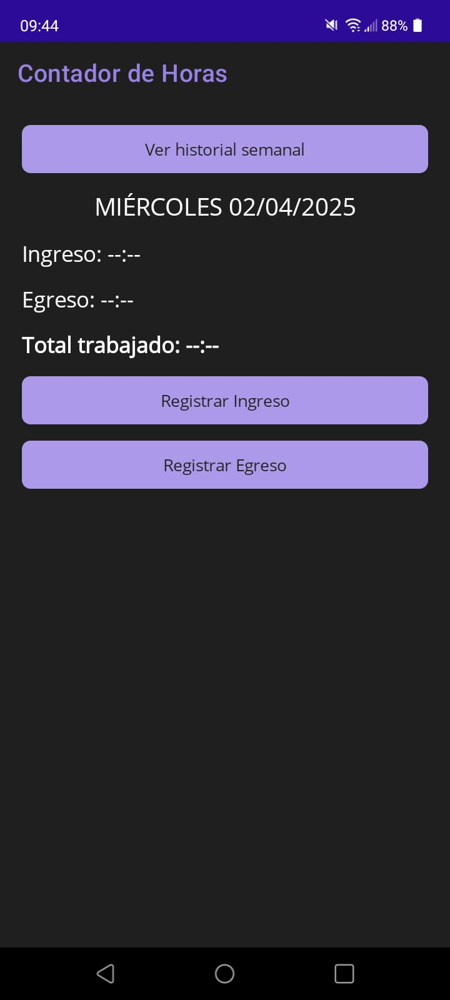
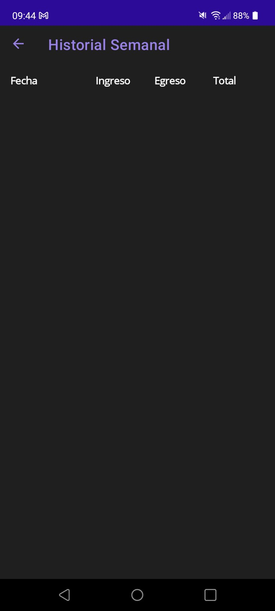
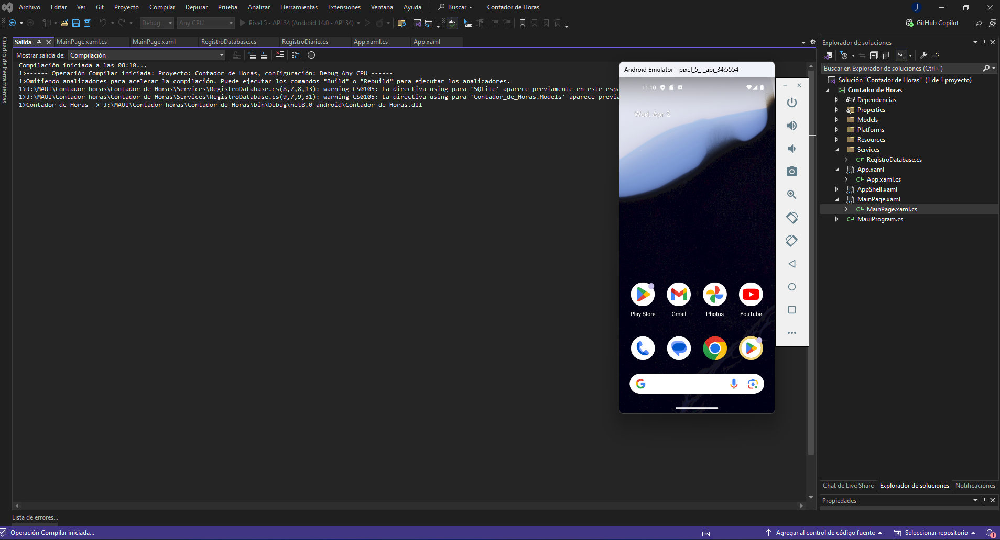

# ⏱ Contador de Horas - App en .NET MAUI

App móvil simple hecha en **.NET MAUI** para registrar tu jornada laboral diaria (ingreso y egreso) y calcular el total semanal. Ideal para empleados, freelancers o proyectos personales.

## 🚀 Tecnologías usadas
- .NET MAUI (C#)
- SQLite (sqlite-net-pcl)
- Visual Studio 2022
- Android SDK (Target: Android 12+)

## 📲 Funcionalidades
- Registro de ingreso/egreso diario
- Cálculo de horas trabajadas
- Historial semanal tipo Excel
- Validaciones: no repetir registros, evitar errores
- Generación de `.apk` para instalación en Android

## 🧪 Capturas de pantalla

| Home | Historial |
|------|-----------|
|  |  |

### 💻 Emulador y Código

| Emulador Android | Código MAUI |
|------------------|-------------|
|  |  |

## 🛠 Instalación
1. Cloná el repo
2. Abrí con Visual Studio 2022 con .NET MAUI instalado
3. Ejecutá en emulador o teléfono Android

## 🔐 Licencia
MIT
